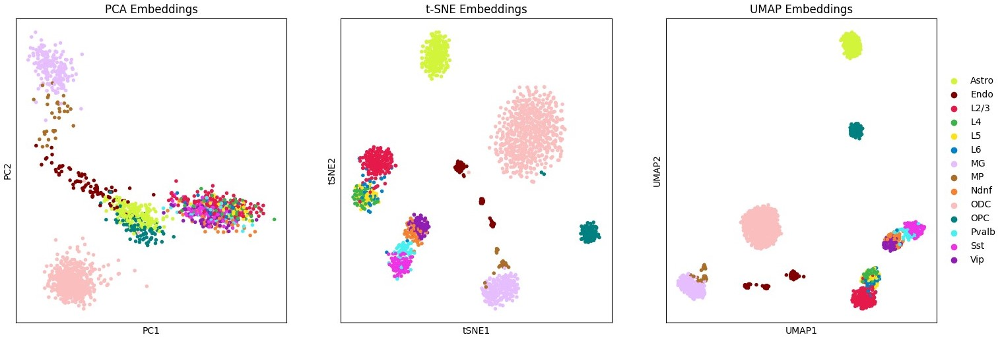
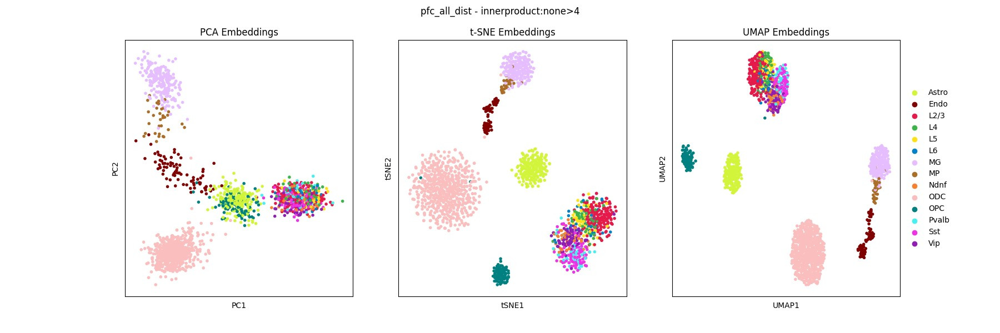

# ***SCORE***: Single-cell Chromatin Organization Representation and Embedding


A Python package developed by the Jin Lab for combining, benchmarking, and extending methods of embedding, clustering, and visualizing single-cell Hi-C data.

## Installation

```bash
git clone https://github.com/JinLabBioinfo/SCORE.git;
cd SCORE;
pip install .
```

Installation should only take a few minutes.

### (Optional) Tensorflow and PyTorch GPU support

Some methods such as Va3DE rely on [GPU accelerated Tensorflow builds](https://www.tensorflow.org/install/pip). Make sure you are using a GPU-build by running

```bash
pip install tensorflow[and-cuda]
```

We also provide Va3DE as a standalone package which can be installed here: https://github.com/JinLabBioinfo/Va3DE

Other methods such as Higashi rely on [GPU accelerated builds of PyTorch](https://pytorch.org/get-started/locally/).

### SCORE Usage

You can verify that the installation was successful by running

```bash
score --help
```

### Tutorials

We provide some tutorials to help you get started:

* [Introduction (Creating .scool files and generating your first embeddings)](https://github.com/JinLabBioinfo/SCORE/blob/bb07e07b50dfc80b1ac3a982159b4c73f2eb6fde/tutorials/intro.ipynb) [](https://colab.research.google.com/drive/1h4a8EEj2m31xrxFDwRKU7S3CykIK5Jkw?usp=sharing)

* Basic Usage (Mouse Embryo) [](https://colab.research.google.com/drive/1WRW5gnQ7se-QfF84jcT4mabvtoEdquLP?usp=sharing)

* Random Walk Comparison (Human PFC and Mouse Embryo) [](https://colab.research.google.com/drive/1saYN7o-MHB__cQd4VaRtRL6kQK3CNlGy?usp=sharing)

* Va3DE (Mouse Embryo) [](https://colab.research.google.com/drive/18hawprSdTEQLeNLiqMrVOFBTqct5BP4q?usp=sharing)

* Va3DE (Human PFC) [](https://colab.research.google.com/drive/1ctZfbUwnIqFr1UeV8p1OedhJR1qATBy9?usp=sharing)

### Supported Embedding Methods

The following embedding methods can be run using the `--methods` or `--embedding_algs` arguments (not case sensitive):

* [scHiCluster](https://doi.org/10.1073/pnas.1901423116) (`scHiCluster`)
* [fastHiCRep+MDS](https://doi.org/10.1093/bioinformatics/bty285) (`fastHiCRep`)
* [InnerProduct+MDS](https://doi.org/10.1371/journal.pcbi.1008978) (`InnerProduct`)
* [scHi-C Topic Modeling](https://doi.org/10.1371/journal.pcbi.1008173) (`cisTopic`)
* [SnapATAC2](https://doi.org/10.1038/s41592-023-02139-9) (`SnapATAC`)
* [scGAD](https://doi.org/10.1093/bioinformatics/btac372) (`scGAD`) (requires [additional R dependencies](https://sshen82.github.io/BandNorm/articles/BandNorm-tutorial.html))
* [Insulation Scores](https://doi.org/10.1038/nature14450) (`Insulation`)
* [DeTOKI](https://doi.org/10.1186/s13059-021-02435-7) (`deTOKI`)
* [scVI-3D](https://doi.org/10.1186/s13059-022-02774-z) (`3DVI`)
* [Higashi](https://doi.org/10.1038/s41587-021-01034-y) (`Higashi`)
* [Fast Higashi](https://doi.org/10.1016/j.cels.2022.09.004) (`fast_higashi`/`fast-higashi`)
* [Va3DE](https://github.com/JinLabBioinfo/Va3DE) (`VaDE`/`Va3DE`)

We also provide additional baseline methods for benchmarking:

* `1D_PCA` (sum all interactions at each bin, embed 1D counts with PCA)
* `2D_PCA` (extract band of interactions, embed with PCA)
* `scVI` (sum all interactions at each bin, train scVI model)
* `scVI_2D` (extract band of interactions, train scVI model)

### Basic CLI usage

We provide a small example dataset in the `examples/data` directory. To run `SCORE` you simple need to provide an input `.scool` file and a metadata reference file. You can specify the embedding tool(s) you wish to test using the `--embedding_algs` argument

```bash
score embed --dset oocyte_zygote \  # name for saving results
            --scool oocyte_zygote_mm10_1M.scool \  # path to scool file
            --reference oocyte_zygote_ref \  # metadata reference
            --embedding_algs InnerProduct \  # embedding method name
            --n_strata 20 \
```

This will create a new `results` directory (or a directory specified by `--out`) where results are stored under the name specified by `--dset`. Visualizations are generated for celltypes and other metadata provided, and if multiple celltype labels are provided, clustering metrics will be computed and stored as well. Additional analysis and visualization can be easily performed with the `anndata_obj.h5ad` Scanpy object which is saved with each run. Most baseline methods on this small dataset should only take a few minutes to run.

We also provide the datasets analyzed in our benchmark publication at various resolutions which can be downloaded from the following to reproduce our results:

#### Mouse Oocyte/Zygote
```bash
wget hiview10.gene.cwru.edu/~dmp131/scHi-C/oocyte_zygote.tar.gz
```

#### Mouse Embryo
```bash
wget hiview10.gene.cwru.edu/~dmp131/scHi-C/embryo.tar.gz
```

#### mESC Cell Cycle (scHi-C)
```bash
wget hiview10.gene.cwru.edu/~dmp131/scHi-C/cell_cycle.tar.gz
```

#### mESC Cell Cycle (scCAREseq)
```bash
wget hiview10.gene.cwru.edu/~dmp131/scHi-C/sccareseq.tar.gz
```

#### Human sciHi-C Mixture
```bash
wget hiview10.gene.cwru.edu/~dmp131/scHi-C/ramani.tar.gz
```

#### Human 4DN sciHi-C Mixture
```bash
wget hiview10.gene.cwru.edu/~dmp131/scHi-C/kim.tar.gz
```

#### Human Prefrontal Cortex 
```bash
wget hiview10.gene.cwru.edu/~dmp131/scHi-C/pfc.tar.gz
```

#### Mouse Brain (HiRes)
```bash
wget hiview10.gene.cwru.edu/~dmp131/scHi-C/hires_brain.tar.gz
```

#### Mouse Hippocampus
```bash
wget hiview10.gene.cwru.edu/~dmp131/scHi-C/mouse_hippocampus.tar.gz
```

#### Human Brain Atlas
```bash
wget hiview10.gene.cwru.edu/~dmp131/scHi-C/human_brain.tar.gz
```

Each of these compressed files contains various .scool files from different resolutions, and a metadata reference file. 
These are the only two required arguments for getting started with embedding analysis.
For example, to reproduce the short-range complex tissue analysis, download and unzip the PFC data, and then we can run:

```bash
score embed --dset pfc \  # name for saving results
            --scool pfc_200kb.scool \  # path to scool file
            --reference pfc_ref \  # metadata reference
            --embedding_algs InnerProduct \  # embedding method name
            --n_strata 10 \  # 0-2Mb
            --min_depth 50000  # filter low depth cells
```



```bash
score embed --dset pfc \  # name for saving results
            --scool pfc_200kb.scool \  # path to scool file
            --reference pfc_ref \  # metadata reference
            --embedding_algs InnerProduct \  # embedding method name
            --strata_offset 10 \  # ignore first 10 strata (i.e 0-2Mb)
            --n_strata 100 \
            --min_depth 50000
```




Including multiple embedding methods and executing multiple runs using `--n_runs` will produce a local benchmark on the dataset provided:

```bash
score embed --dset embryo \  # name for saving results
            --scool embryo_500kb.scool \  # path to scool file
            --reference embryo_ref \  # metadata reference
            --ignore_filter \  # keep all cells
            --embedding_algs 1d_pca InnerProduct scHiCluster \
            --n_runs 10
```


### Useful Arguments

* `--load_results` will skip the embedding step and just compute metrics based on the embeddings that are already saved

* `--no_viz` will skip PCA, t-SNE, and UMAP visualizations to save time

* `--eval_celltypes` provide a list of celltypes to further cluster, visualize, and compute metrics for

* `--subsample_n_cells` to randomly select a certain number of cells from the dataset

* `--continuous` will compute Average Circular ROC for a dataset such as the cell cycle

* `--ignore_filter` will ignore all filtering criteria

* `--ignore_chr_filter` will ignore the per-chromosome filtering criteria (i.e a chromosome of length <m>Mb must have at least m reads)


### Developer Instructions

```bash
make test
```

Will run a suite of tests ranging from basic matrix operations, dataset loading, converting, and full pipelines of every method.
Currently takes ~30 mins on a 24 core 256GB system with no GPU (we only do a couple iterations of each method which requires GPU for testing).
Profile this on your own machine using:

```bash
make profile
```
