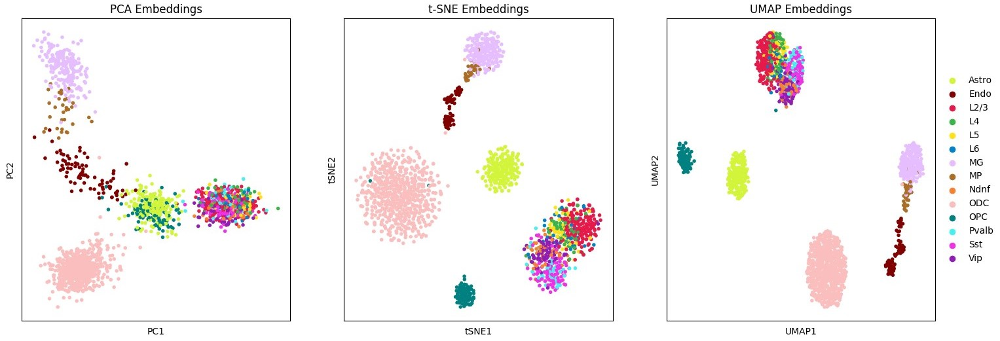

# ***SCORE***: Single-cell Chromatin Organization Representation and Embedding


A Python package developed by the Jin Lab for combining, benchmarking, and extending methods of embedding, clustering, and visualizing single-cell Hi-C data.

## Installation

```bash
git clone https://github.com/JinLabBioinfo/SCORE.git;
pip install .
```

Installation should only take a few minutes.

### (Optional) Tensorflow and PyTorch GPU support

Some methods such as Va3DE rely on [GPU accelerated Tensorflow builds](https://www.tensorflow.org/install/pip). Make sure you are using a GPU-build by running

```bash
pip install tensorflow[and-cuda]
```

Other methods such as Higashi rely on [GPU accelerated builds of PyTorch](https://pytorch.org/get-started/locally/).

### SCORE Usage

You can verify that the installation was successful by running

```bash
score --help
```

We provide a small example dataset in the `examples/data` directory. To run `SCORE` you simple need to provide an input `.scool` file and a metadata reference file. You can specify the embedding tool(s) you wish to test using the `--embedding_algs` argument

```bash
score embed --dset oocyte_zygote \  # name for saving results
            --scool oocyte_zygote_mm10_1M.scool \  # path to scool file
            --reference oocyte_zygote_ref \  # metadata reference
            --embedding_algs InnerProduct \  # embedding method name
            --n_strata 20 \
```

This will create a new `results` directory (or a directory specified by `--out`) where results are stored under the name specified by `--dset`. Visualizations are generated for celltypes and other metadata provided, and if multiple celltype labels are provided, clustering metrics will be computed and stored as well. Additional analysis and visualization can be easily performed with the `anndata_obj.h5ad` Scanpy object which is saved with each run. Most baseline methods on this small dataset should only take a few minutes to run.

We also provide the datasets analyzed in our benchmark publication at various resolutions which can be downloaded from the following to reproduce our results:

```bash
wget -r hiview10.gene.cwru.edu/~dmp131/scHi-C
```

For example, to reproduce the short-range complex tissue analysis, we can run:

```bash
score embed --dset pfc \  # name for saving results
            --scool pfc_200kb.scool \  # path to scool file
            --reference pfc_ref \  # metadata reference
            --embedding_algs InnerProduct \  # embedding method name
            --n_strata 10 \  # 0-2Mb
            --min_depth 50000  # filter low depth cells
```


```bash
score embed --dset pfc \  # name for saving results
            --scool pfc_200kb.scool \  # path to scool file
            --reference pfc_ref \  # metadata reference
            --embedding_algs InnerProduct \  # embedding method name
            --strata_offset 10 \  # ignore first 10 strata (i.e 0-2Mb)
            --n_strata 100 \
            --min_depth 50000
```

